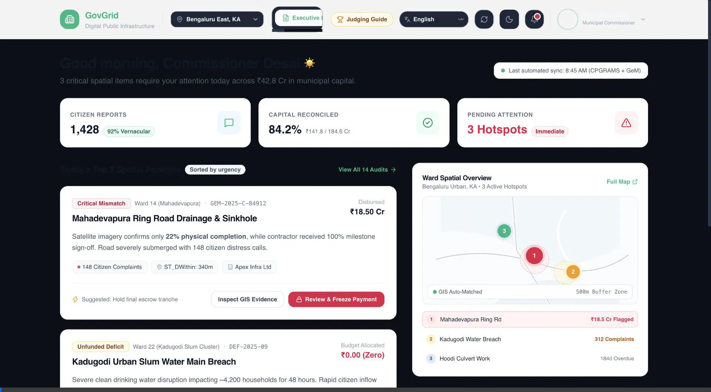

# 🎥 GovGrid — Solution Demo Video & Walkthrough

> **Track 1: AI for Digital Public Infrastructure & Governance**  
> *Build with AI: Code for Communities (Season 2)*

---

## 📺 Video Walkthrough

The animated video demonstration below showcases the full end-to-end GovGrid DPI reconciliation workflow:

---

## ⏱️ Video Timestamp Highlights

| Time / Frame | Workflow Stage | Key Technical Action Shown |
| :---: | :--- | :--- |
| **0:00 - 0:15** | **Executive Briefing & Priorities** | Live reconciliation overview showing ₹42.8 Cr public capital analyzed, ₹18.5 Cr flagged for audit, and 3 critical municipal priority hotspots. |
| **0:15 - 0:35** | **Jan-Vani Multilingual Voice Notes** | Ingesting native Telugu, Kannada, and Hindi voice grievances via WhatsApp Audio simulation; synchronized audio waveform playback and damage severity scoring. |
| **0:35 - 0:55** | **BigQuery GIS Spatial Cross-Matching** | Automated `ST_DWithin` 500m buffer queries matching citizen grievance clusters against GeM civil contracts. |
| **0:55 - 1:15** | **Vertex AI Forensic Discrepancy Audits** | Multimodal photogrammetry audit comparing contractor milestone photos against satellite SAR feeds (detecting 22% actual concrete pour vs 100% billed completion). |
| **1:15 - 1:35** | **GFR Rule 175 Escrow Payment Freeze** | Municipal Commissioner issuing legally binding payment freeze directives and contractor vigilance summons under Section 71(b). |
| **1:35 - 1:55** | **Interactive Ward GIS Map & Hexbins** | Visualizing Uber H3 resolution-9 distress clusters across Bengaluru East (BBMP), Anantapur Rural, and Varanasi. |
| **1:55 - 2:15** | **Civic FAQ & Quick Links (⌘K)** | Fast-dispatch search modal across all DPI modules and interactive accordion knowledge base. |

---

## 🌐 Try the Live Solution Now

* 🔗 **Live Web Application**: **[https://govgrid.web.app](https://govgrid.web.app)**
* 📦 **Pitch Deck**: **[`../pitch_deck/govgrid_pitch_deck.pdf`](../pitch_deck/govgrid_pitch_deck.pdf)**
* 💻 **Editable PPTX**: **[`../pitch_deck/govgrid_pitch_deck.pptx`](../pitch_deck/govgrid_pitch_deck.pptx)**
