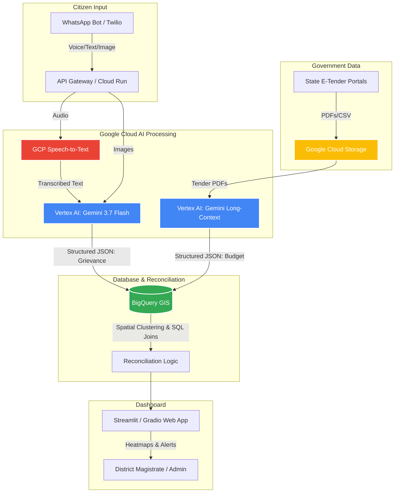

# GovGrid: System Design & Architecture
**Theme:** AI for Digital Public Infrastructure and Governance
**Core Objective:** End-to-End DPI Accountability Engine bridging citizen grievances with public budget execution.

## 1. Architectural Diagram
*(Note: You can render this Mermaid.js diagram natively in most markdown viewers, GitHub, or Notion)*

## 2. Google Cloud Services Mapping (Hackathon Scoring Focus)
To score maximum points in the **25% AI/Technical Execution** rubric, emphasize these native GCP integrations in your code and pitch:

*   **Vertex AI (Gemini 3.7 Flash):** The core reasoning engine. Used for two distinct multimodal tasks:
    1.  *Grievance Parsing:* Analyzing uploaded pothole/infrastructure photos to estimate severity (P1-P4) and parsing translated text into structured JSON.
    2.  *Document Parsing:* Ingesting 50-page unstructured government PDF tenders to extract budget allocations, timelines, and geo-coordinates.
*   **Google Cloud Speech-to-Text (V2):** Handles the vernacular audio messages (JanVani layer), translating regional dialects into English text for Gemini to process.
*   **BigQuery (with BigQuery GIS):** This is your spatial deduplication engine. Instead of a standard SQL DB, use BigQuery's `ST_DISTANCE` functions to cluster 100 citizen complaints from the same 500-meter radius into a single "Infrastructure Deficit Zone."
*   **Google Cloud Storage (GCS):** The landing zone for user-uploaded images and scraped government PDFs.
*   **Google Maps Platform (Geocoding API):** Converts raw text like "Behind the main post office, Anantapur" into exact Lat/Lng coordinates for BigQuery mapping.
*   **Google Cloud Run:** Containerize your Python backend (FastAPI/Flask) and deploy here for a live, scalable URL (satisfies the "Deployed link" submission requirement).